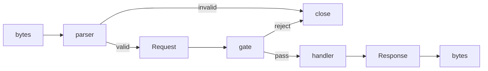
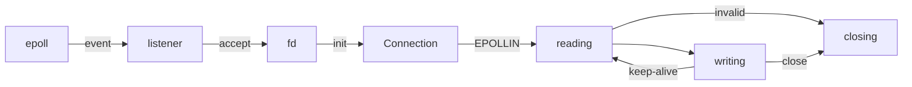

# Fragile
Fragile is not fragile. It defines HTTP at the kernel boundary.

## Philosophy
Most servers are permissive.  
They accept garbage, guess intent, and recover from ambiguity.

Fragile rejects this.

Invalid input is rejected. Ambiguity is not resolved.

What appears fragile is precision.

The behavior is fixed. The boundaries are defined. Nothing is implicit.  
Fragile accepts bytes. It defines boundaries. It rejects ambiguity.

> No libc.  
> Boundary is the kernel.

At the lowest layer, everything looks fragile. That is why nothing breaks.

## Requirements
- Zig 0.15.2
- Linux (epoll; Tested with Gentoo 6.12.21)

Fragile runs with Zig alone. No additional tools are required.  
Alternatively, a reproducible development environment is provided via Nix:
```
nix develop
```

This environment provides Zig in a fixed version and includes optional tools such as netcat, wrk, and jq for testing and debugging.

## Running
```
zig build run
curl http://localhost:8080
```

## Testing

### Smoke Test
Run a quick end-to-end test:

```
sh smoke.sh
```

This verifies that the server accepts valid requests and rejects invalid ones.

### Unit Tests
Run the parser test suite:

```
zig build test --summary all
```

These tests define the accepted syntax and rejection rules.

## Specification
HTTP is a contract over bytes.  
It defines how text is structured, not how it is interpreted.

Fragile - HTTP/1.1 Strict (draft specification)  
https://fragile-v1.notion.site/

Fragile defines a strict subset of this specification.  
Ambiguity is not tolerated.

### Reference
RFC 9112 — HTTP/1.1  
https://www.rfc-editor.org/rfc/rfc9112

RFC 9110 - HTTP Semantics  
https://www.rfc-editor.org/rfc/rfc9110

RFC 9111 - HTTP Caching  
https://www.rfc-editor.org/rfc/rfc9111

This implementation defines message syntax (RFC 9112).  
Semantics (RFC 9110) and caching (RFC 9111) are intentionally out of scope.

## Scope
Fragile defines a strict HTTP/1.1 (RFC 9112) message layer.

It accepts well-formed and unambiguous input.  
Invalid or incomplete input is rejected.

The implementation operates at the syntax level only.  
It does not interpret message semantics.

The following are in scope:

- Request line parsing (method, path, protocol)
- Header parsing (strict format)
- Content-Length handling
- Message completeness validation
- Response serialization
- Connection lifecycle management (keep-alive)

The following are out of scope:

- HTTP semantics (RFC 9110)
- Caching (RFC 9111)
- Content interpretation (e.g. JSON, form, multipart)
- Transfer encodings (e.g. chunked)

Scope defines the protocol boundary, not the architecture.

## Architecture
Architecture defines how bytes flow, how state evolves, and how the system executes.

### Data flows


### Lifecycle


No layer guesses intent.  
No layer corrects invalid input.  
If the structure is not defined, it is rejected.  

This architecture makes boundaries explicit.

### Structure
```
src/
  main.zig               -- wires all layers
  net/
    sys/
      epoll.zig          -- syscall remap (epoll)
      fd.zig             -- syscall remap (read/write/close/writev)
      socket.zig         -- syscall remap (socket/bind/listen/accept)
      process.zig        -- syscall remap (fork/waitpid/sigaction)
    listener.zig         -- composes syscalls into listening socket
  server/
    worker.zig           -- forks workers, monitors children
    loop.zig             -- drives epoll loop, defines policy
    connection.zig       -- holds connection state and buffers
  http/
    parser.zig           -- protocol dispatch facade
    request.zig          -- defines HTTP request structures
    response.zig         -- defines Response and serializes to bytes
    status.zig           -- protocol data (200, 400, 404...)
    handler.zig          -- defines Handler boundary
    gate.zig             -- pass or reject decisions
    http1/
      parser.zig         -- HTTP/1.1 parsing logic
  payload/
    payload.zig          -- payload type definition (stub)
    json.zig             -- JSON parsing (stub)
    form.zig             -- form-urlencoded parsing (stub)
    multipart.zig        -- multipart/form-data parsing (stub)
```

### Execution Model
Fragile uses a multi-process architecture.

The parent process initializes the listening socket and spawns worker processes.  
Each worker runs an independent event loop and accepts connections directly.

Workers do not share state.  
No synchronization or locking is used.

Load is distributed by the kernel using `SO_REUSEPORT`.  
Each worker is a complete and isolated server instance.


## Design
No allocation in the HTTP core. Non-blocking I/O. Explicit state.

Modules are composable.  
They attach at defined boundaries. No module alters the core flow.

The system exposes a single integration point:

```
Handler(Request) → Response
```

All extensions are implemented as handlers.

Modules are independent. Modules do not share state.  
Allocation, if any, is explicit and local. The core flow is fixed.

Fragile does not implement HTTP. It defines it.

## License
Copyright KEI SAWAMURA 2026.  
Fragile is licensed under the MIT License. Use, copy, and modify freely.
