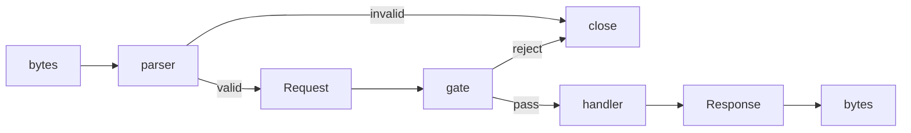
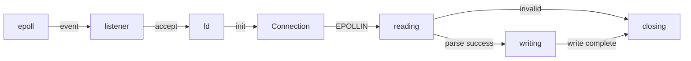

# Fragile
Fragile is not fragile. It defines HTTP at the kernel boundary.

## Philosophy
Most servers are permissive.  
They accept garbage, guess intent, and recover from ambiguity.

Fragile rejects this.

Invalid input is rejected. Ambiguity is not resolved.

What appears fragile is precision.

The behavior is fixed. The boundaries are defined. Nothing is implicit.  
Fragile accepts bytes. It defines boundaries. It rejects ambiguity.

> No libc.  
> Boundary is the kernel.

At the lowest layer, everything looks fragile. That is why nothing breaks.

## Requirements
- Zig 0.15.2
- Linux (epoll; Tested with Gentoo 6.12.21)

## Running
```
zig build run
curl http://localhost:8080
```

## Specification
HTTP is a contract over bytes.  
It defines how text is structured, not how it is interpreted.

Fragile - HTTP/1.1 Strict (draft specification)  
https://fragile-v1.notion.site/

Fragile defines a strict subset of this specification.  
Ambiguity is not tolerated.

### Reference
RFC 9112 — HTTP/1.1  
https://www.rfc-editor.org/rfc/rfc9112

RFC 9110 - HTTP Semantics  
https://www.rfc-editor.org/rfc/rfc9110

RFC 9111 - HTTP Caching  
https://www.rfc-editor.org/rfc/rfc9111

This implementation defines message syntax (RFC 9112).  
Semantics (RFC 9110) and caching (RFC 9111) are intentionally out of scope.

## Scope
Fragile defines a strict HTTP/1.1 message parser and responder.

It accepts well-formed and unambiguous input.  
Invalid or incomplete input is rejected.

The implementation operates at the syntax level only.  
It does not interpret message semantics.

The following are in scope:

- Request line parsing (method, path, protocol)
- Header parsing (strict format)
- Content-Length handling
- Message completeness validation
- Response serialization

The following are out of scope:

- HTTP semantics (RFC 9110)
- Caching (RFC 9111)
- Content interpretation (e.g. JSON, form, multipart)
- Transfer encodings (e.g. chunked)
- Connection reuse (keep-alive)

Scope defines the protocol, not the architecture.

## Architecture
Fragile is structured as a strict separation of concerns.  
Each layer has a single responsibility and does not depend on higher layers.

- `main` initializes the process and defines the entry point.
- `server/loop` drives the system using epoll. It does not interpret data.
- `server/connection` represents a connection as a state machine.
- `http/parser` transforms bytes into structured data. It is pure and has no IO.
- `http/request` defines the shape of a request. It contains no behavior.
- `http/response` defines the response and handles serialization.

### Data flows


### Lifecycle


No layer guesses intent.  
No layer corrects invalid input.  
If the structure is not defined, it is rejected.  

This architecture makes boundaries explicit.

### Structure
```
  src/
    main.zig           -- wires all layers
    net/
      epoll.zig        -- thin wrapper around epoll syscalls
      listener.zig     -- binds port and accepts connections
      socket.zig       -- raw fd operations
    server/
      connection.zig   -- holds connection state and buffers
      loop.zig         -- drives epoll loop and dispatches events
    http/
      parser.zig       -- protocol dispatch facade
      request.zig      -- defines HTTP request structures
      response.zig     -- defines Response and serializes to bytes
      status.zig       -- protocol data (200, 400, 404...)
      handler.zig      -- defines Handler boundary
      gate.zig         -- pass or reject decisions
      http1/
        parser.zig     -- HTTP/1.1 parsing logic
```

### Dependency
```
main
 └─ server/loop
     ├─ net/epoll
     ├─ net/listener
     ├─ net/socket
     ├─ server/connection
     │   └─ net/socket
     ├─ http/parser
     │   └─ http/http1/parser
     │       └─ http/request
     └─ http/gate
         └─ http/request
```

Each layer does exactly one thing. Nothing more.  
The structure is not an implementation detail. It is the system.

## Design
No allocation in the HTTP core. Non-blocking I/O. Explicit state.

Modules are composable.  
They attach at defined boundaries. No module alters the core flow.

The system exposes a single integration point:

```
Handler(Request) → Response
```

All extensions are implemented as handlers.

Modules are independent. Modules do not share state.  
Allocation, if any, is explicit and local. The core flow is fixed.

Fragile does not implement HTTP. It defines it.

## License
Copyright KEI SAWAMURA 2026.  
Fragile is licensed under the MIT License. Use, copy, and modify freely.
