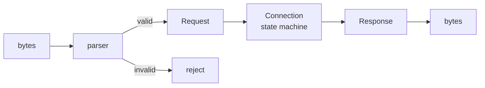

# Fragile
A Fragile is not fragile - It is a precisely defined HTTP/1.1 implementation in Zig.

## Philosophy
Most servers are permissive.  
They accept garbage, guess intent, and recover from ambiguity.

Fragile rejects this.

Invalid input is rejected. Ambiguity is not resolved.

What appears fragile is precision.

The behavior is fixed. The boundaries are defined. Nothing is implicit.  
Fragile accepts bytes. It defines boundaries. It rejects ambiguity.

## Architecture
Fragile is structured as a strict separation of concerns.  
Each layer has a single responsibility and does not depend on higher layers.

- `main` initializes the process and defines the entry point.
- `server/loop` drives the system using epoll. It does not interpret data.
- `server/connection` represents a connection as a state machine.
- `http/parser` transforms bytes into structured data. It is pure and has no IO.
- `http/request` defines the shape of a request. It contains no behavior.
- `http/response` defines the response and handles serialization.

Data flows in one direction:



No layer guesses intent.  
No layer corrects invalid input.  
If the structure is not defined, it is rejected.  

This architecture makes boundaries explicit.

The structure is:

```
  src/
    main.zig           -- entry point, listener setup
    http/
      parser.zig       -- parse() function (pure, no IO)
      request.zig      -- Request struct   (pure data)
      response.zig     -- Response struct + serialize
    server/
      connection.zig   -- Connection state machine
      loop.zig         -- epoll loop (flows data, no logic)
````

Dependency graph:

```
  main
   └─ server/loop
       ├─ server/connection
       └─ http/parser
           └─ http/request
````

Each layer does exactly one thing. Nothing more.  
The structure is not an implementation detail. It is the system.

